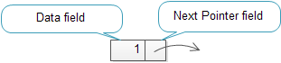

# Note For CPP questions

## difference between 'class' and 'public class'

Without specifying `public` the class is implicitly `internal`. This means that the class is only visible inside the same assembly. When you specify `public1`, the class is visible outside the assembly.

It is also allowed to specify the `internal` to modify explicitly.

## C linked list

a linked list is used to implement other data structure such as stack and queue.

```
typedef struct node {
    int data;
    struct node * next;
}
```

The node structure has two members:
* data stores the information
* next pointer holds the address of the next node.

