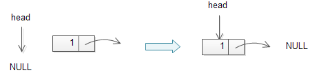

# Note For CPP questions

## difference between 'class' and 'public class'

Without specifying `public` the class is implicitly `internal`. This means that the class is only visible inside the same assembly. When you specify `public1`, the class is visible outside the assembly.

It is also allowed to specify the `internal` to modify explicitly.

## C linked list

a linked list is used to implement other data structure such as stack and queue.

```
typedef struct node {
    int data;
    struct node * next;
}
```

The node structure has two members:
* data stores the information
* next pointer holds the address of the next node.
`node * head;` declare a head pointer that always points to the first node of the list

We need to create a new node each time we want to insert a new node into the list so we can develop a function that creates a new node and return it.

```
node * create(int data, node* next) {
    node * new_node = (node*) malloc(sizeof(node));

    if (new_node == NULL) {
        printf("Error creating a new node.\n");
        exit(0):
    }
    new_node->data = data;
    new_node->next = next;

    return new_node;
}
```
Second, we need to point the `next` pointer to the new node to the head pointer. It works for both empty and non-empty linked list.
```
node* prepend(node* head, int data) {
    node * new_head = create(data, head);
    head = new_head;
    return head;
}
```


